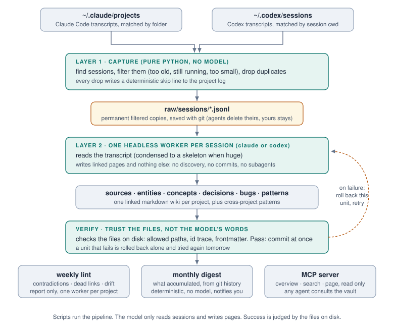

# A5N

Turn your AI coding agent transcripts into a knowledge base that outlives them.

A5N is a numeronym for AIBrain, the way k8s abbreviates Kubernetes: first
letter, five letters, last letter.

[Türkçe](README.tr.md)

## The problem

Claude Code and Codex write every session to disk, then delete it. Claude Code
clears transcripts after `cleanupPeriodDays`, thirty days by default. So the
reasoning behind a decision you made six weeks ago, the root cause of a bug you
already fixed once, the reason you rejected the obvious approach, all of it is
gone. You keep solving the same problem, and your agent keeps proposing the
approach you already rejected, because neither of you can remember.

## What A5N does

Every morning a deterministic script finds yesterday's sessions and copies the
raw transcripts somewhere permanent. Then one headless agent per session
distils it into a linked markdown wiki: one page per session, plus pages for
the decisions, bugs, entities and concepts it touches. Once a week the same
machinery audits that wiki for contradictions, dead links and schema drift.

The output is plain markdown in a git repository. Obsidian is a nice way to
browse it and is entirely optional. Nothing is stored anywhere but your disk.



The most valuable folder is `patterns/`. When a lesson is not tied to one
project, it gets its own page there, and your next project finds it. That is
what turns a pile of notes into knowledge that keeps growing in value.

See [example/](example/) for four pages of invented output, and
[the pattern page](example/patterns-example/retry-without-a-budget-amplifies-an-outage.md)
for what the system is actually for.

## What the vault looks like

Plain folders, plain markdown. Every project you configure gets its own
namespace, and a handful of folders live at the root:

```
vault/
├── <project>/             one namespace per configured project
│   ├── sources/sessions/  one page per processed session: what happened, why
│   ├── decisions/         choices made, with the reasoning behind them
│   ├── bugs/              root causes you already paid once to find
│   ├── entities/          the moving parts: services, tools, libraries
│   ├── concepts/          domain ideas that need their own explanation
│   ├── syntheses/         bigger write-ups stitched from several sessions
│   ├── archive/           pages that stopped being true, kept for the record
│   ├── raw/               original transcripts, byte for byte, never edited
│   └── log.md             one line per event: ingested, skipped, linted
├── patterns/              lessons that outgrew one project
├── chess-moves/           strategy sessions, looking forward
├── digests/               the monthly summaries
└── GOALS.md               where you are headed, in your own words
```

Almost everything in the vault looks backwards: it records what already
happened and why. `chess-moves/` is the one folder that looks the other
way. A chess moves page is the written trace of a strategy session with
your agent: where the project stands, which options are on the table, what
you decide to try next, one dated file per sitting. The agent reads the
wiki as evidence while you think out loud together, and the conclusion you
land on goes into `GOALS.md`. The wiki remembers your past, chess moves
point at your future, and `GOALS.md` holds the current answer.

## Install

Requires macOS or Linux, Python 3.9 or newer, git, and either the Claude Code
CLI or the Codex CLI for the unattended runs. You pick which one runs the
workers, with which model and at what reasoning effort, in the `[runner]`
section of `config.ini`. The example config lists the valid values ready to
copy, so a typo cannot break a scheduled run.

```bash
git clone https://github.com/ardasenn/A5N.git
cd A5N
cp config.example.ini config.ini
$EDITOR config.ini
zsh scripts/setup.sh
```

`setup.sh` creates the vault, writes the schema into it, adds a namespace per
configured project, initialises git, and installs the scheduled jobs. Run it
again any time: existing pages are never overwritten, so rerunning is how you
add a project or change the schedule.

The scheduled jobs are launchd agents on macOS and systemd user timers on
Linux. Either way a run the machine slept through is caught up when it comes
back, so a desktop that is off at 09:07 still ingests that day.

Nothing runs until `config.ini` exists. A fresh checkout cannot touch a vault
by accident.

## Configuration

One file, `config.ini`. Adding a project is one section:

```ini
[project:acme-shop]
repo = ~/work/acme-shop
match = acme-shop
watermark = 2026-01-01
```

`match` is a substring. It is checked against the Claude Code project folder
name and against the Codex session working directory, so one value usually
covers both, and git worktrees match automatically because their paths contain
it too.

`watermark` is a fixed date, not a rolling window. Sessions older than it are
ignored. Set it to today to start clean, or to an older date to pull in
history. Because it is fixed rather than rolling, a machine that was off for a
week loses nothing when it comes back.

See [config.example.ini](config.example.ini) for every setting.

## Running it

```bash
zsh scripts/daily-ingest.sh    # what the scheduler runs each morning
zsh scripts/weekly-lint.sh     # what it runs weekly
```

Both are safe to run by hand at any time. They take a lock, so a manual run and
a scheduled one never run at the same time: a run that finds the lock taken
waits for the other one to finish, up to two hours, and says so on the
terminal. Ctrl-C stops the wait.

## Two machines, one vault

One vault can live on two machines, say a work desktop and a personal
laptop. Each machine has its own A5N checkout and its own `config.ini`,
listing the projects whose transcripts live there. Pages travel through a
private git remote. Raw transcripts travel with them or, when they are too
big for git, through any storage rclone can reach, every machine keeping a
full copy.

Turn it on in `config.ini` on both machines:

```ini
[sync]
enabled = yes
remote = origin
branch = main
raw_remote = gdrive:my-vault
lock = yes
```

`remote` and `branch` name the vault's git remote. `raw_remote` is an rclone
path; each project's raw files live under `<raw_remote>/<project>/raw`.
Leave it empty to keep raw files in git. When you set it, add `**/raw/` to
the vault's `.gitignore`, or raw files travel twice.

With sync on, every run:

1. pulls first (a fetch, then a rebase of any local commits),
2. downloads the raw files the other machine added,
3. captures new sessions, uploads raw files, then pushes,
4. takes a lock on the remote before any model worker starts, and pushes
   after every processed session.

The lock is a ref on the remote, `refs/a5n/lock`, created only if it does
not exist yet, so when both machines start at once exactly one runs
workers. The other still captures and pushes, then waits up to an hour for
the lock. When it gets the lock it looks at the vault again, as after a
wait for the remote (below), before any worker starts. The lock is
refreshed after every session, and one older than two hours is treated as
left behind by a crash.

Nothing is ever deleted or overwritten on either side: raw files are copied
with `rclone copy --immutable`, and pushes are never forced. `log.md` files
only ever grow, so when both machines added lines, both are kept (setup
writes that rule into the vault's `.git/info/attributes`). Any other conflict
stops that machine's workers and notifies you. A session whose push
conflicts is dropped and processed again on the next run.

When the remote cannot be reached at the start of a run, the run keeps
trying for up to `offline_after` seconds, 15 minutes by default. The usual
cause is a run the scheduler starts at boot because the machine was off at
its time: the network may not be up yet, and on Linux, where lingering lets
user timers run without a login, nobody may have logged in yet, so a git
credential kept in the desktop keyring (where `gh` keeps its token) is
still locked. After three quick attempts, while nobody is logged in, the
run leaves the remote alone and watches for a login; it tries again within
20 seconds of the login, and once more when the time is up. Before it goes
on, it looks at the vault again: edits you made meanwhile get a commit of
their own, and a rebase you started or another branch you checked out
stops the run without touching anything. If the remote is still out of
reach when the time is up, the run captures and commits locally, skips the
workers, and pushes next time; lint and digest are skipped with a
notification. A run you start by hand waits the same way, and Ctrl-C stops
it cleanly. `offline_after = 0` gives up after the three quick attempts. If
sync keeps failing for more than a day, you get a notification.

On the second machine, set `lint = off` and `digest = off` in `[schedule]`:
lint reports and digests are rewritten whole, so one machine should own
them. Give the two machines different ingest times too, or one of them will
spend its run waiting for the other's lock.

To add the second machine, clone the vault, write its `config.ini` and run
setup. Its first run downloads the raw files.

```bash
git clone <your vault's remote> ~/knowledge-vault
cp config.example.ini config.ini   # in the A5N checkout: [sync] as above
zsh scripts/setup.sh
```

`setup.sh` checks that the git remote and the rclone remote exist, and that
the vault is on the sync branch, before it installs anything. Your git host
has to accept refs outside branches and tags; if it does not, the first run
tells you.

## Reading it back

Writing pages is only half the job: your agents also need to read them. A5N
ships an MCP server that gives any MCP capable agent read access to the vault,
with search, an overview, and full page reads. Register it once per machine
and every agent session can check the vault before repeating your history:

```bash
claude mcp add --scope user a5n -- python3 "$(pwd)/scripts/a5n-mcp.py"
```

```toml
# Codex, in ~/.codex/config.toml
[mcp_servers.a5n]
command = "python3"
args = ["/path/to/A5N/scripts/a5n-mcp.py"]
```

The server is read only and never opens `raw/`. It does its own ranking, so
a query adds no model cost. `setup.sh` prints these commands with the real
paths filled in.

Registering the server makes the vault reachable. It does not make agents
look, because an available tool is not a used tool: without a standing
instruction, agents answer history questions from guesswork instead of the
archive. Add a block like this to each project's CLAUDE.md or AGENTS.md:

```markdown
## Knowledge vault (A5N)

This project has a permanent knowledge archive: decisions, bug root causes
and architecture notes distilled from earlier agent sessions.

- When you need history, an old bug or the reason behind a decision, ask
  the a5n MCP server first: `vault_overview` for the catalogue,
  `vault_search` for anything specific.
- For methods and lessons that span projects, search the pattern pages.
- The vault is read only from here. Writing is done by the vault's own
  automation, never from this repository.
```

## Seeing what accumulates

Once a month a plain script (no model involved) turns the vault's git history
into one page under `digests/`: sessions processed per project, pages created
and updated, new patterns, the most referenced pages, and a health line. If a
whole month went by with nothing processed, the digest says so, because
without that line you cannot tell a broken pipeline from a quiet month.

```bash
zsh scripts/digest.sh            # previous month
zsh scripts/digest.sh 2026-07    # any month
```

At setup time, if sessions are already waiting, A5N offers to process them
right away, so you see your first pages within minutes instead of waiting for
tomorrow's schedule. The `watermark` in `config.ini` controls how far back
that history reaches.

## How it holds together

Unattended jobs fail quietly unless you design against it. A5N's answer is
one principle: scripts run the pipeline, the model only reads sessions and
writes pages.

- **Finding sessions never involves a model.** A Python script scans the
  transcript folders, filters the candidates, drops duplicates, and copies the
  rest into the vault. This part cannot hallucinate, and it is the only urgent
  part: agents delete old transcripts, so the copy must happen in time.
- **One worker per session, judged by its files.** Each queued session gets
  its own headless agent run. When it ends, a script looks at what actually
  landed on disk: are the changed paths allowed, did a page or a reasoned
  skip line appear, is the frontmatter complete. What the worker says about
  its own work is never trusted. An earlier design trusted a result line in
  the output, and a single stray backtick once threw away twelve processed
  sessions.
- **Each session commits on its own.** A unit that passes is committed on the
  spot. A unit that fails is rolled back alone and retried tomorrow; the other
  units' work is already safe. There is no bookkeeping file: a raw transcript
  that has no trace in the pages is still in the queue, by definition.
- **A rejected unit gets one more chance.** The rejection reasons are added
  to the prompt and the worker runs once more, so a small mistake is fixed
  within the same run instead of repeating for days.
- The vault is a git repository and the tree is always clean before a worker
  starts, so a rollback can only ever touch that one worker's output.
- One lock file is shared by every job, ingest, lint and digest, so none can
  overlap another. It is created in one step, so of two jobs that start in
  the same instant exactly one gets it. A job that finds it taken waits, up
  to two hours, instead of skipping: the scheduler starts every run the
  machine was off for together at boot, and a skipped lint or digest would
  wait a week or a month for its next slot.
- A lock whose owner is gone is treated as dead, because a crash cannot run
  the cleanup trap and a stale lock would silently swallow every later run.
  Only one waiting job can take such a lock over. A job that is still
  running keeps its lock however long it takes, across a suspend too: two
  hours without a touch free a lock only when its process number now
  belongs to another program.
- With sync on, the lock has a second half: a ref on the git remote that
  only one machine at a time can hold while model workers run. It is
  refreshed after every session, so a long run never looks abandoned.
- A run killed in the middle of a session leaves a marker behind. The next
  run moves the half written pages to `git stash` instead of committing
  them as if you had written them. If the run that wrote them is still
  going, its lock removed by hand say, the next run stops without touching
  them, gives the lock back to it and tells you; run that job again by
  hand once the other run is done.
- A watchdog kills a worker that exceeds its per unit wall clock. Not a work
  limit, only a guard against hanging forever.
- Skipping is never silent. When a session is dropped for being too small or
  a duplicate, the script itself writes a line saying so in the project log.
  Two cases write no line on purpose: sessions older than your configured
  watermark, and sessions still in use, which simply wait for tomorrow.
- On a day with nothing to do, the model is never invoked. Silence is success,
  a notification fires only on failure.

Each of those exists because the missing version of it caused a real failure.

## Transcript formats

| | Claude Code | Codex |
|---|---|---|
| Location | `~/.claude/projects/<folder>/<uuid>.jsonl` | `~/.codex/sessions/YYYY/MM/DD/rollout-*.jsonl` |
| Project matched by | folder name | the session's own working directory |
| Filtered out on copy | `attachment/hook_success`, about 64% | `event_msg/token_count`, about 1.4% |

Both filters drop only records that carry no information at all. Everything
else is copied byte for byte, images included. Adding a record type to a
filter list is a schema change: prove it carries nothing first.

Large transcripts are condensed before reading. Size comes from embedded
screenshots rather than content, so dropping those has taken a 107 MB session
down to 404 KB with the conversation intact.

Cursor is not supported. It keeps chat history in a SQLite file with an
undocumented schema that changes between releases, so an adapter would break
often. Pull requests welcome if you disagree.

## Licence

MIT. See [LICENSE](LICENSE).
