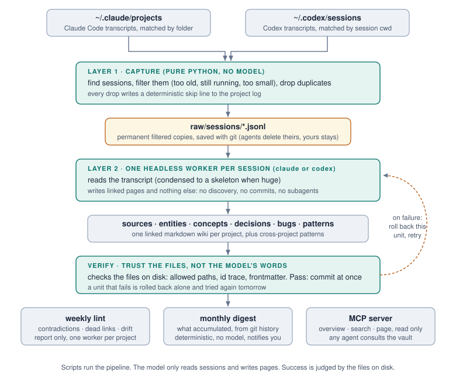

# A5N

AI kodlama ajanı transkriptlerini, onlardan uzun ömürlü bir bilgi arşivine
çevirir.

[English](README.md)

## Sorun

Claude Code ve Codex her oturumu diske yazar, sonra siler. Claude Code
transkriptleri `cleanupPeriodDays` süresinden sonra temizler, varsayılanı otuz
gün. Yani altı hafta önce verdiğin bir kararın gerekçesi, bir kez çözdüğün
bug'ın kök nedeni, bariz görünen yaklaşımı neden reddettiğin, hepsi gitmiş
olur. Aynı problemi tekrar çözersin, ajan da zaten reddettiğin yaklaşımı
tekrar önerir, çünkü ikiniz de hatırlamıyorsunuz.

## A5N ne yapar

Her sabah deterministik bir script dünkü oturumları bulur ve ham
transkriptleri kalıcı bir yere kopyalar. Sonra oturum başına bir headless ajan
onu bağlantılı bir markdown wiki'ye damıtır: oturum başına bir sayfa, artı
dokunduğu kararlar, bug'lar, entity'ler ve kavramlar için sayfalar. Haftada
bir de aynı mekanizma o wiki'yi çelişki, ölü link ve şema sapması açısından
denetler.

Çıktı bir git repo'sundaki düz markdown. Obsidian gezinmek için güzel bir yol
ve tamamen isteğe bağlı. Hiçbir şey senin diskinin dışına çıkmaz.



En değerli klasör `patterns/`. Bir ders tek projeye bağlı değilse orada kendi
sayfasını alır ve bir sonraki projen onu hazır bulur. Not yığınını zamanla
değeri artan bilgiye çeviren şey budur.

Uydurma dört sayfalık örnek çıktı için [example/](example/) klasörüne, sistemin
asıl amacı için
[pattern sayfasına](example/patterns-example/retry-without-a-budget-amplifies-an-outage.md)
bakın.

## Vault neye benziyor

Düz klasörler, düz markdown. Yapılandırdığın her proje kendi namespace'ini
alır, kökte de birkaç ortak klasör yaşar:

```
vault/
├── <proje>/               yapılandırılan her proje için bir namespace
│   ├── sources/sessions/  işlenen her oturuma bir sayfa: ne oldu, neden
│   ├── decisions/         verilen kararlar, arkasındaki gerekçeyle
│   ├── bugs/              bulmak için bir kez bedel ödediğin kök nedenler
│   ├── entities/          hareketli parçalar: servisler, araçlar, kütüphaneler
│   ├── concepts/          kendi açıklamasını hak eden alan kavramları
│   ├── syntheses/         birden çok oturumdan dikilen büyük yazılar
│   ├── archive/           doğruluğu geçmiş sayfalar, kayıt için saklanır
│   ├── raw/               orijinal transcript'ler, bayt bayt, asla düzenlenmez
│   └── log.md             olay başına bir satır: işlendi, atlandı, lint edildi
├── patterns/              tek projeye sığmayan dersler
├── chess-moves/           ileriye bakan strateji oturumları
├── digests/               aylık özetler
└── GOALS.md               nereye gittiğin, kendi cümlelerinle
```

Vault'taki hemen her şey geriye bakar: olmuş biteni ve nedenini kaydeder.
`chess-moves/` ters yöne bakan tek klasördür. Bir chess moves sayfası,
ajanınla yaptığın bir strateji oturumunun yazılı izidir: proje nerede
duruyor, masada hangi seçenekler var, sırada ne denemeye karar verdin;
oturum başına tarihli bir dosya. Sen sesli düşünürken ajan wiki'yi kanıt
olarak okur, vardığın sonuç da `GOALS.md`'ye yazılır. Wiki geçmişini
hatırlar, chess moves geleceğini gösterir, `GOALS.md` güncel cevabı tutar.

## Kurulum

macOS veya Linux, Python 3.9 ya da üstü, git, ve gözetimsiz koşular için
Claude Code CLI ile Codex CLI'dan biri gerekir. İşçileri hangisinin, hangi
modelle ve hangi reasoning effort'la koşturacağını `config.ini` içindeki
`[runner]` bölümünden seçersin. Örnek config geçerli değerleri kopyalanmaya
hazır listeler, yazım hatası zamanlanmış koşuyu bozamaz.

```bash
git clone https://github.com/ardasenn/A5N.git
cd A5N
cp config.example.ini config.ini
$EDITOR config.ini
zsh scripts/setup.sh
```

`setup.sh` vault'u oluşturur, şemayı içine yazar, config'teki her proje için
bir namespace açar, git'i başlatır ve zamanlanmış görevleri kurar. İstediğin
zaman tekrar çalıştırabilirsin: mevcut sayfaların üzerine asla yazmaz,
dolayısıyla yeni proje eklemenin ve zamanlamayı değiştirmenin yolu budur.

`config.ini` yoksa hiçbir şey çalışmaz. Taze bir klon yanlışlıkla bir vault'a
dokunamaz.

## Konfigürasyon

Tek dosya, `config.ini`. Proje eklemek tek bir bölüm:

```ini
[project:acme-shop]
repo = ~/work/acme-shop
match = acme-shop
watermark = 2026-01-01
```

`match` bir alt dizedir. Hem Claude Code proje klasörünün adına hem Codex
oturumunun çalışma dizinine bakılır, dolayısıyla tek değer genelde ikisini de
kapsar. Git worktree'leri de otomatik eşleşir, çünkü yolları aynı alt dizeyi
içerir.

`watermark` sabit bir tarihtir, kayan bir pencere değil. Ondan eski oturumlar
yok sayılır. Temiz başlamak için bugünü, geçmişi çekmek için daha eski bir
tarihi yaz. Sabit olduğu için, bir hafta kapalı kalan makine geri döndüğünde
hiçbir şey kaybetmez.

Tüm ayarlar için [config.example.ini](config.example.ini) dosyasına bakın.

## Çalıştırma

```bash
zsh scripts/daily-ingest.sh    # zamanlayıcının her sabah koştuğu
zsh scripts/weekly-lint.sh     # haftalık koştuğu
```

İkisi de istediğin an elle çalıştırılabilir. Kilit aldıkları için elle koşu ile
zamanlanmış koşu çakışamaz.

## Geri okumak

Sayfa yazmak işin yarısı: ajanların onları okuyabilmesi de gerek. A5N bunun
için bir MCP server ile gelir; MCP destekli her ajan vault'ta arama yapabilir,
genel görünümü alabilir ve sayfaları okuyabilir. Makine başına bir kez
kaydet, her ajan oturumu geçmişini tekrarlamadan önce vault'a baksın:

```bash
claude mcp add --scope user a5n -- python3 "$(pwd)/scripts/a5n-mcp.py"
```

```toml
# Codex, ~/.codex/config.toml içine
[mcp_servers.a5n]
command = "python3"
args = ["/path/to/A5N/scripts/a5n-mcp.py"]
```

Server salt okunurdur ve `raw/` altını asla açmaz. Sıralamayı kendi yaptığı
için bir sorgunun ekstra model maliyeti yoktur. `setup.sh` bu komutları
gerçek yollarla doldurup basar.

Server'ı kaydetmek vault'u erişilir yapar. Ajanların bakmasını sağlamaz,
çünkü erişilebilir araç kullanılan araç değildir: kalıcı bir talimat yoksa
ajan geçmiş sorularını arşive bakmak yerine tahminle cevaplar. Her projenin
CLAUDE.md veya AGENTS.md dosyasına şuna benzer bir blok ekle:

```markdown
## Bilgi arşivi (A5N)

Bu projenin kalıcı bir bilgi arşivi var: önceki ajan oturumlarından süzülen
kararlar, bug kök nedenleri ve mimari notlar.

- Geçmiş bağlam, eski bir bug veya bir kararın nedeni gerektiğinde önce
  a5n MCP server'ına sor: katalog için `vault_overview`, belirli bir şey
  için `vault_search`.
- Projeler arası yöntem ve dersler için pattern sayfalarında ara.
- Vault buradan salt okunurdur. Yazmayı vault'un kendi otomasyonu yapar,
  bu repodan asla yazılmaz.
```

## Birikeni görmek

Ayda bir, düz bir script (model yok) vault'un git geçmişini `digests/`
altında tek sayfaya çevirir: proje başına işlenen oturumlar, açılan ve
güncellenen sayfalar, yeni pattern'lar, en çok referans alan sayfalar ve bir
sağlık satırı. Koca ay hiçbir şey işlenmeden geçtiyse özet bunu açıkça
söyler; o satır olmasa bozulan sistemi sakin aydan ayırt edemezsin.

```bash
zsh scripts/digest.sh            # geçen ay
zsh scripts/digest.sh 2026-07    # herhangi bir ay
```

Kurulum anında bekleyen oturumlar varsa A5N onları hemen işlemeyi önerir;
ilk sayfalarını yarınki zamanlanmış koşuyu beklemeden dakikalar içinde
görürsün. `config.ini` içindeki `watermark` o geçmişin ne kadar geriye
uzanacağını belirler.

## Neden bozulmuyor

Gözetimsiz görevler, aksi tasarlanmadıkça sessizce başarısız olur. A5N'in
cevabı tek ilke: boru hattını script'ler yönetir, model sadece oturum okur
ve sayfa yazar.

- **Oturum bulma işine model hiç karışmaz.** Bir Python script'i transkript
  klasörlerini tarar, adayları eler, kopyaları ayıklar, kalanları vault'a
  kopyalar. Bu kısım halüsinasyon göremez ve işin tek acele kısmı da budur:
  ajanlar eski transkriptleri sildiği için kopya zamanında alınmalıdır.
- **Oturum başına bir işçi, dosyalarıyla yargılanır.** Kuyruktaki her oturum
  kendi headless ajan koşusunu alır. Koşu bitince bir script diske gerçekten
  ne yazıldığına bakar: değişen yollar izinli mi, bir sayfa ya da gerekçeli
  skip satırı oluşmuş mu, frontmatter tam mı. İşçinin kendi işi hakkında
  söylediklerine asla güvenilmez. Önceki tasarım çıktıdaki bir sonuç
  satırına güveniyordu ve tek bir backtick yüzünden işlenmiş on iki oturum
  bir kerede çöpe gitmişti.
- **Her oturum kendi başına commit'lenir.** Geçen birim anında commit'lenir.
  Kalan birim tek başına geri alınır ve yarın yeniden denenir; diğerlerinin
  işi çoktan güvendedir. Ayrı bir kayıt dosyası yoktur: sayfalarda izi
  olmayan ham transkript, tanım gereği hâlâ kuyruktadır.
- **Reddedilen birim bir şans daha alır.** Red sebepleri prompt'a eklenir ve
  işçi bir kez daha koşar; küçük bir hata günlerce tekrarlamak yerine aynı
  koşuda düzelir.
- Vault bir git repo'sudur ve işçi başlamadan önce ağaç her zaman temizdir,
  dolayısıyla geri alma yalnızca o işçinin çıktısına dokunabilir.
- Tek kilit dosyasını bütün görevler paylaşır, ingest, lint ve digest,
  dolayısıyla hiçbiri diğeriyle çakışamaz. İki saatten eski kilit ölü
  sayılır, çünkü çöken bir süreç temizlik trap'ini çalıştıramaz ve ölü kilit
  sonraki tüm koşuları sessizce yutar.
- Watchdog, birim başına duvar saatini aşan işçiyi keser. Bu bir iş sınırı
  değil, sadece sonsuza asılmaya karşı bir koruma.
- Atlama asla sessiz olmaz. Küçük ya da kopya olduğu için elenen her oturum
  için satırı script'in kendisi proje log'una yazar, modelden rica edilmez.
  İki durum bilerek satır almaz: senin ayarladığın watermark'tan eski
  oturumlar ve hâlâ kullanımda olan oturumlar, onlar sadece yarını bekler.
- Yapılacak iş olmayan günde model hiç çağrılmaz. Sessizlik başarıdır,
  bildirim sadece hatada düşer.

Bunların her biri, eksik olduğu bir versiyonda gerçek bir arıza yaşandığı için
var.

## Transkript formatları

| | Claude Code | Codex |
|---|---|---|
| Konum | `~/.claude/projects/<klasör>/<uuid>.jsonl` | `~/.codex/sessions/YYYY/MM/DD/rollout-*.jsonl` |
| Proje eşleşmesi | klasör adı | oturumun kendi çalışma dizini |
| Kopyada süzülen | `attachment/hook_success`, yaklaşık %64 | `event_msg/token_count`, yaklaşık %1.4 |

İki süzme de yalnızca hiçbir bilgi taşımayan kayıtları atar. Geri kalan her şey
bayt bayt kopyalanır, görseller dahil. Süzme listesine yeni kayıt türü eklemek
şema değişikliğidir: önce hiçbir şey taşımadığını kanıtla.

Büyük transkriptler okunmadan önce yoğunlaştırılır. Boyut içerikten değil gömülü
ekran görüntülerinden gelir, dolayısıyla onları atmak 107 MB'lık bir oturumu
konuşma bütünlüğü bozulmadan 404 KB'a indirdi.

Cursor desteklenmiyor. Sohbet geçmişini, sürümler arasında değişen ve
belgelenmemiş bir şemayla SQLite dosyasında tutuyor, dolayısıyla yazılacak
adaptör sık sık kırılırdı. Aksini düşünüyorsanız pull request bekleriz.

## Lisans

MIT. Bkz. [LICENSE](LICENSE).
